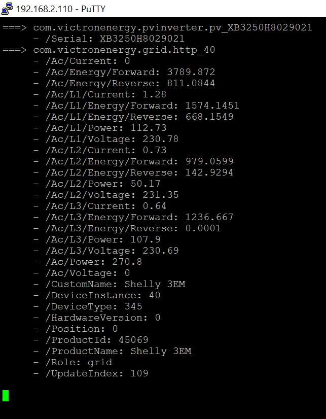

# dbus-console-monitor
Little Python script to read DBUS services paths and their values - regularly updated. Tested and used in [Victron Venus OS](https://github.com/victronenergy/venus) environment

## Purpose / Intro
I used this script in my latest Python projects related to DBus and Victron Venus OS.
e.g. [Shelly 3EM as grid meter for Venus OS / GX device](https://github.com/fabian-lauer/dbus-shelly-3em-smartmeter)
With regular automated refresh of data. Should work univeral, but `GetValue()` function is required on path to work....

Later I realized that Victron made a cool tool which is included into Venus OS - `dbus-spy`.
Get more details here [https://github.com/victronenergy/dbus-spy](https://github.com/victronenergy/dbus-spy)

## How it works
### My setup
- Victron Energy Cerbo GX with Venus OS - Firmware v2.84
  - Connected to Multiplus2
  - Connected to Wifi netowrk "A"
  - IP 192.168.2.110/24
  - Custom scripts to feed data into DBus

## Install & Configuration
Just get the latest script-file from this repository.
Configuration is done within the script - see inline comments

### Pictures

